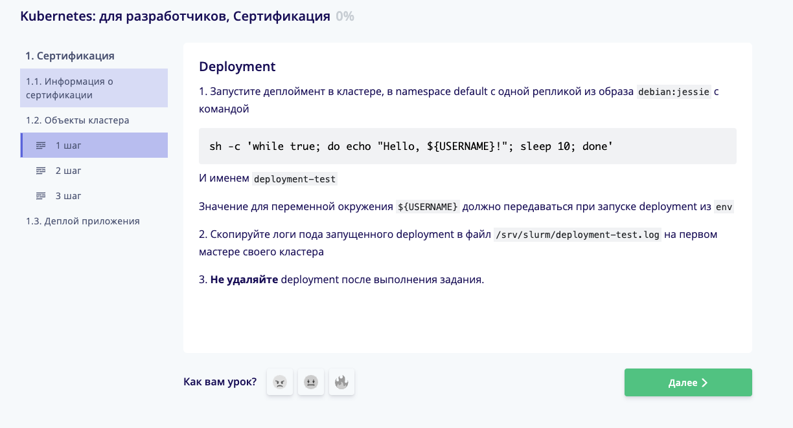
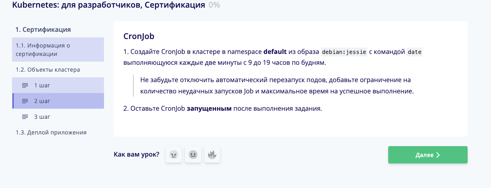
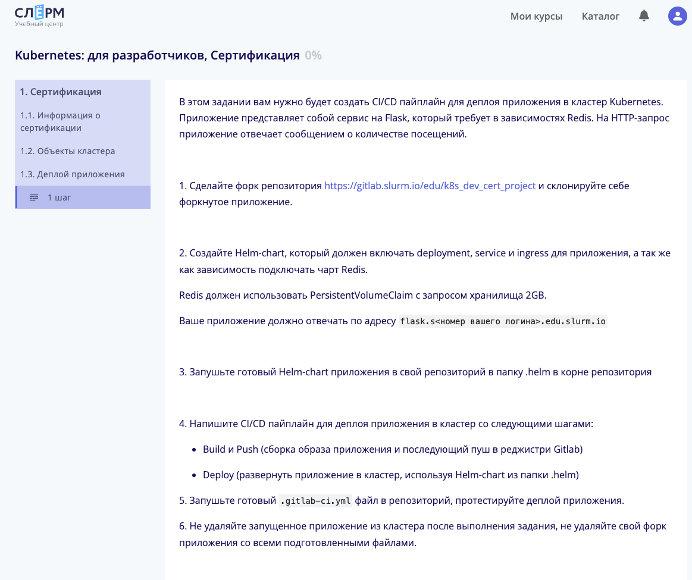

# Итоговая сертификация. Курс slurm.io Kubernetes: для разработчиков

В репозитории 4 папки, каждая соответствует номеру задания. 
В папках с заданиями с 1 по 3 лежат манифесты, которые нужно применить, но необходимо подправить некоторые данные:

## Задания с 1 по 3 - Объекты кластера (default namespace)
## Task_1 - deployment

Необходимо изменить значение переменной в env с SomeValue на необходимое Вам.
Результат вывода лога пода необходимо скопировать в файл по пути /srv/slurm/deployment-test.log
```
mkdir /srv/slurm/
kubectl get pod
kubectl logs 'наименование нужного нам пода из результата предыдущей команды'
```

В результате будет нечто "Hello, SomeValue (это значение из переменной)"

Копируем результат, вставляем в файл и файл кладем по адресу из задания
```
nano /srv/slurm/deployment-test.log
```
Или любым другим редактором


Скрин задания 1


## Task_2 - cronjob
Тут не нужно ничего менять, просто убедится через пару минут, что все работает, проверив лог.
Должны будут остаться поды со статусом завершено.

Скрин задания 2


## Task_3 - набор манифестов (deployment, ingress, service (NodePort, ClusterIP), configmap, )
В папке [separated_manifests](task_3%2Fseparated_manifests) все то же самое что и в файле [3.yaml](task_3%2F3.yaml), только раздельно.<br>
В файле [3.yaml](task_3%2F3.yaml) в Ingress изменить 'Ваш_номер_студента' на Ваш номер. <br>
Убедиться что задание совпадает.

К сожалению, скрин с этим заданием не сохранился.

Смысл задания в том, что curl по определенным url должен выдать разные сообщения
 curl ingress-test.s'ваш номер студента'.edu.slurm.io/1    ->    I am 1.21
 curl ingress-test.s'ваш номер студента'.edu.slurm.io/2    ->    I am 1.22


### Task_4 - Деплой приложения
Самое интересное.<br>
Скрин задания 4
<br><br>
В папке task_4 есть папка [prepare](task_4%2Fprepare)

1. Необходимо запустить скрипт setup.sh с двумя параметрами
    ```
    ./setup.sh s'ваш номер студента'-k8s-dev-cert-project production
    ```
    где s'ваш номер студента'-k8s-dev-cert-project - NS, состоящий из номера студента и названия репозитория в гите.<br>
    production - окружение
    <br><br>
    Полученный в результате работы скрипта токен нужно добавить в репозиторий.<br>
    Название K8S_CI_TOKEN значение из результата работы скрипта. Все остальное в переменной стандартное.<br>
    <br><br>

2. В репозитории перейти в раздел settings-Repository-deploy tokens и добавить новый токен.<br>
   Имя k8s-pull-token поставить галочку read_registry нажать create deploy token. <br>
   Полученные в результате username и password вставить в переменные в скрипте [docker_pull_secret.sh](task_4%2Fprepare%2Fdocker_pull_secret.sh)
   <br><br>

3. В скрипте [docker_pull_secret.sh](task_4%2Fprepare%2Fdocker_pull_secret.sh) помимо username и token необходимо изменить:

   docker-email - на желаемый
   NS - 'Namespace как при запуске скрипта'-production
   где namespace - то же наименование, которое вы указывали при запуске скрипта из п.1, только там это было 2 значения, а тут одно.<br><br>

4. Запустить docker_pull_secret.sh
    ```
    ./docker_pull_secret.sh
    ```
5. Применить pv.yaml
    ```
    kubectl apply -f pv.yaml
    ```
   в результате создадутся PersistentVolume и PersistentVolumeClaim<br><br>

6. В файле [values.yaml](task_4%2F.helm%2Fvalues.yaml) изменить:
   image - адрес до образа, в моем случае это registry.slurm.io/s'Ваш номер студента'/'Наименование репозитория'/
   ingress.host - flask.s'Ваш номер студента'.edu.slurm.io<br><br>

7. В файле [Chart.yaml](task_4%2F.helm%2FChart.yaml) изменить:<br>
   maintainers.email - ваш email<br>
   maintainers.name - ваше имя<br>
   sources - flask.s'Ваш номер студента'.edu.slurm.io<br><br>

8. В файле [.gitlab-ci.yml](task_4%2F.gitlab-ci.yml) проверить значение для переменной variables.K8S_API_URL<br>
   для этого необходимо выполнить 
   ```
   kubectl get node -o wide
   ```
   в списке найти master-1.s'Ваш номер студента'.slurm.io<br> 
   скопировать ip адрес и вставить в значение переменной K8S_API_URL<br><br>

9. Все файлы можно создать руками либо клонировать из этого репозитория.<br>
   Для запуска проекта необходимо запушить в репозиторий на slurm следующие папки и файлы, сохраняя при этом структуру:
   - [.helm](task_4%2F.helm)
   - [application](task_4%2Fapplication)
   - [.gitlab-ci.yml](task_4%2F.gitlab-ci.yml)
   - [docker-compose.yml](task_4%2Fdocker-compose.yml)
   - [Dockerfile](task_4%2FDockerfile)


P.S. У меня все работает, НО постоянно что-то меняется - названия стандартных переменных, версии в манифестах и тд. <br>
На дату пуша - все работает, но я уже сомневаюсь в адекватности [ingress.yaml](task_4%2F.helm%2Ftemplates%2Fingress.yaml)<br>
Если вдруг что-то не запускается - то с очень большой вероятностью ответ вы найдете либо в логах pipeline на гите, либо в describe чего-либо!
## Спасибо за внимание и удачи.